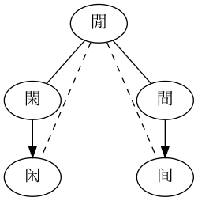
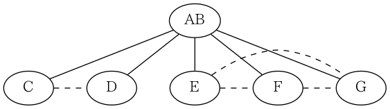
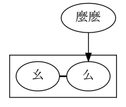
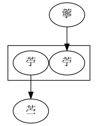
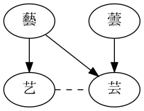

# Yitizi

[](https://pypi.org/project/yitizi/) [](https://www.npmjs.com/package/yitizi) [](https://www.jsdelivr.com/package/npm/yitizi) [](https://github.com/nk2028/yitizi/actions?query=workflow%3APackage)

Input a Chinese character. Output all the variant characters of it.<br>
輸入一個漢字，輸出它的全部異體字。<br>
输入一个汉字，输出它的全部异体字。

## Usage

### Python

```sh
pip install yitizi
```

```python
>>> import yitizi
>>> yitizi.get('和')
['咊', '龢']
```

### JavaScript (Node.js)

```sh
npm install yitizi
```

```javascript
> const Yitizi = require('yitizi');
> Yitizi.get('和');
[ '咊', '龢' ]
```

### JavaScript (browser)

```html
<script src="https://cdn.jsdelivr.net/npm/yitizi@0.1.0"></script>
```

```javascript
> Yitizi.get('和');
[ '咊', '龢' ]
```

## Design

Connections between variant characters can be modeled as an _graph_ with characters as vertices, where two characters are variants of each other if they are _directly_ connected by an edge.

To reduce data redundancy, only several types of basic connections are stored in data tables located in `data/`, from which the full graph `yitizi.json` is computed by invoking `build/main.py`.

### Basic connections

A basic connection between two variant characters can be classified into one of the three types: equivalent, intersecting, simplification.

- Equivalent "全等": Two characters are equivalent only if they are interchangable in most texts without change in the meaning. When computing the full graph, it is considered both commutative and transitive, i.e.

  - If A is an equivalent variant of B, then B is an equivalent variant of A;
  - If A is an equivalent variant of B, and B is an equivalent variant of C, then A is an equivalent variant of C.

- Intersecting "語義交疊": Two characters are intersecting variants if they are interchangable in certain cases. It is also commutative, and can be treated either _fully transitive_ (same as equivalent) or _per-group transitive_ (transitive only within the same row in the data table).

  NOTE: currently only the fully transitive version is implemented).

  Example (per-group transitive version, available soon™): "閒" has two intersecting variants: "閑" and "間", listed in two rows:

  ```csv
  #字,全等,語義交疊,簡體
  閒,,閑,
  閒,,間,间
  閑,,,闲
  ```

  Then in the computed `yitizi.csv`:

  - 閒 and 閑 (闲) are variants of each other;
  - 閒 and 間 (间) are variants of each other;
  - 閑 (闲) and 間 (间) are unrelated.

  

  A more complex (though abstract) example:

  ```
  #字,全等,語義交疊
  A,B,CD,
  A,,EFG,
  ```

  - A, B, C and D are variants of one another;
  - A, B, E, F and G are variants of one another;
  - No connections between C (or D) and E (or F/G).

  

- Simplification "簡體": A non-transitive and asymmetric connection. A simplified character is associated only with its traditional form. The traditional form is unrelated to other types of variants of the same character.

  Example 1: "么" is 1) a simplified form of "麼", 2) an equivalent variant of "幺"; "麼" has an equivalent variant "麽", then:

  - 麼, 麽 and 么 are variants of one another;
  - 幺 and 么 are variants of each other;
  - 麼 or 麽 is unrelated to 幺.

  

  Example 2: "苧" is 1) a simplified form of "薴", 2) a traditional form of "苎", then:

  - 苧 is a variant of 薴 and 苎;
  - 薴 and 苎 are unrelated.

  

  Example 3: "芸" is a simplified form of "藝" (Japanese _Shinjitai_) and "蕓" (Chinese), and "艺" is also a simplified form of "藝" (Chinese), then:

  - 藝, 芸 and 艺 are variants of one another;
  - 蕓 and 芸 are variants of each other;
  - 藝 or 艺 is unrelated to 蕓.

  

### Data source

- `data/ytenx`: From [BYVoid/ytenx](https://github.com/BYVoid/ytenx/tree/39c2ba1a51d16269241e00d7c0fdf698bdf68326/ytenx/sync/jihthex)
- `data/opencc`: From [BYVoid/OpenCC](https://github.com/BYVoid/OpenCC/tree/7a60db1b098e87e81bb489aa66bcbfa4ab3cd576/data/dictionary)

## Note for developers

You need to substitute all the occurrences of the version string before publishing a new release.
