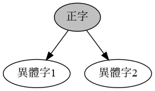

# Yitizi

Input a Chinese character. Output all the variant characters of it.<br>
輸入一個漢字，輸出它的全部異體字。<br>
输入一个汉字，输出它的全部异体字。

## Usage

### Python

Installation:

```sh
pip install yitizi
```

Usage:

```python
>>> import yitizi
>>> yitizi.get('和')
['咊', '龢']
```

### JavaScript

Installation:

Usage:

```javascript
> const Yitizi = require('./index.js')
> Yitizi.get('和')
[ '咊', '龢' ]
```

## Design

As shown in the figure, the following information is stored in `yitizi.csv`:



This file is processed by `build/main.py`. The data in the file is converted into a graph.

Then, for each node in the graph, output the node and all its neighbor nodes. This becomes the final dictionary of the variant characters.

```
{ 正字: 異體字1, 異體字2,
  異體字1: 正字,
  異體字2: 正字
}
```

When using the library, the above dictionary is used to determine the variant characters of a given character.
